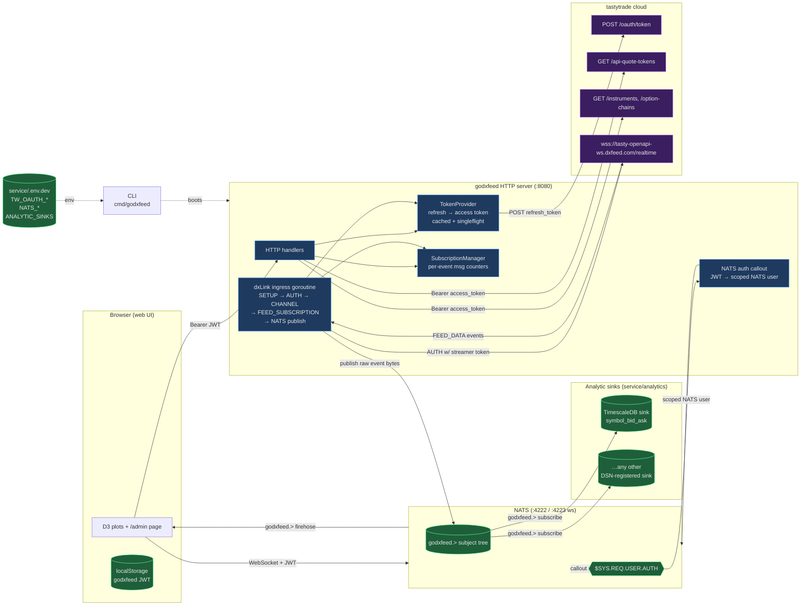

# godxfeed

Go-native client for the [dxFeed / dxLink](https://github.com/dxFeed/dxLink)
WebSocket protocol, wrapped in an HTTP + NATS service that lets browsers
(and whatever else you want to plug in) consume real-time tastytrade quotes.

Requires a [tastytrade developer](https://developer.tastytrade.com/) account
with an OAuth Personal Grant — see
[How To: Authenticate with tastytrade](#how-to-authenticate-with-tastytrade-one-time-setup).

The server runs one dxLink WebSocket, parses `FEED_DATA` messages, and
publishes each event to a NATS subject (`godxfeed.<SYMBOL>`). Everything
downstream — the browser UI, the TimescaleDB writer, any future sidecar — is
just a NATS subscriber. **NATS is the single source of truth.**

## Project Goals

The project has three layered goals. Each layer depends only on the one
below it, so you can use just the pieces you need.

1. **A simple, convenient Go client for dxFeed (`dxclient/`).** The base
   layer: a small programmatic interface that handles the dxLink handshake,
   feed channel lifecycle, and incremental subscription updates. Usable on
   its own, no service or UI required. If all you want is to pull quotes
   into a Go program, import `dxclient`.
2. **A UI that visualizes the data.** The HTTP server + NATS fan-out +
   browser pages (`/plots`, `/admin`) turn the raw feed into something a
   human can watch: histograms, line charts, an options grid, a live
   subscriptions dashboard.
3. **A natural-language interface to the client.** The UI talks to service
   endpoints that carry an LLM-provider dependency; those endpoints accept
   user voice or text, translate it into concrete `dxclient` commands
   (subscribe SPY, show the options chain for AAPL, etc.), and dispatch
   them. The LLM is just a translator between human intent and the
   programmatic API from goal 1.

## Architecture



**Key paths:**
- **Auth chicken-and-egg:** the server bootstraps itself from OAuth creds in
  `service/.env.dev` (`TW_OAUTH_CLIENT_SECRET`, `TW_OAUTH_REFRESH_TOKEN`).
  Browsers authenticate separately via a godxfeed JWT minted from
  `POST /token` (basic-auth gated by `SERVER_SECRET_KEY`).
- **Two NATS identities on the server:** the Go process connects twice — once
  as the app user (publishes `godxfeed.<SYMBOL>`) and once as the auth-callout
  user (services `$SYS.REQ.USER.AUTH`). Browsers connect with their godxfeed
  JWT; the callout exchanges it for a scoped NATS user allowed to subscribe
  to `godxfeed.>`.
- **NATS as single source of truth:** the dxLink ingress goroutine is the
  **only** thing that publishes to `godxfeed.>`. TimescaleDB persistence, the
  browser UI, and any future consumer (e.g. a Bayesian-σ sidecar) are all
  independent NATS subscribers. No dual-path writes.
- **Raw bytes end-to-end:** the ingress parses a dxLink `FEED_DATA` envelope
  just enough to extract each event's `eventSymbol`, then publishes the raw
  per-event JSON to NATS unmodified. Sinks and consumers re-parse whatever
  fields they care about.

## How To: Run Without Market Hours (synthetic data)

For development and end-to-end validation off-market, the repo ships a
fully decoupled mock at `tools/synth/` — a Python process that
impersonates tasty's dxLink gateway and replays PyMC-sampled quotes
from a DuckDB file at the stored cadence. No tastytrade OAuth, no
live connection required.

```bash
# One-shot — starts everything and opens /admin in your browser.
scripts/synth-up.sh     # idempotent; safe to re-run
scripts/synth-down.sh   # stop

# Or drive the pieces yourself:
make synth-install    # one-time: uv sync the Python deps
make synth-generate   # sample a prior → quotes.duckdb
make synth-serve      # ws://127.0.0.1:9999/realtime — leave running
make run-http-mock    # Go server pointed at the mock
```

See [`tools/synth/README.md`](./tools/synth/README.md) for details. The
`--dxfeed-url` flag on `cli run http-server` is what switches the
ingress from tastytrade to a local WS URL; it also short-circuits the
OAuth streamer-token round-trip so the Go side can run without real
credentials.

## How To: Dev Stack (tmux)

```bash
make dev-up       # start nats + http server + dummy publisher in tmux session 'godxfeed-dev'
make dev-attach   # attach
make dev-down     # tear down (refuses if you're attached to the session)
make dev-status   # show windows
```

Logs are tee'd to `logs/http.log`, `logs/nats.log`, `logs/publisher.log` —
`make tail-http-log` / `tail-nats-log` for convenience.

The individual targets (`make run-nats-server`, `make run-http-dev`,
`make run-nats-dummy-publisher`) can be run standalone if you'd rather drive
the stack by hand.

## How To: Authenticate with tastytrade (one-time setup)

tastytrade deprecated username/password session auth on 2024-12-01. This
project uses an **OAuth 2.0 Personal Grant** — mint long-lived credentials
once in the tastytrade web UI and the server refreshes short-lived access
tokens transparently.

1. Log into [tastytrade](https://tastytrade.com) (use the sandbox at
   `developer.cert.tastyworks.com` for dev).
2. Open **OAuth Applications → Manage → Create Grant** and generate a
   Personal Grant. Redirect URI can be anything plausible
   (e.g. `http://localhost:8080/oauth/callback`) — it's never hit for a
   Personal Grant.
3. Copy `client_secret` and `refresh_token` into `service/.env.dev`:

   ```bash
   TW_OAUTH_TOKEN_URL=https://api.cert.tastyworks.com/oauth/token
   TW_API_HOST=api.cert.tastyworks.com
   TW_OAUTH_CLIENT_SECRET=...
   TW_OAUTH_REFRESH_TOKEN=...
   ```

4. Sanity-check:

   ```bash
   make check-oauth   # -> {"token":"...","dxlink-url":"...","level":"..."}
   ```

For production, repeat in a prod grant and put values in `service/.env.prod`
(URLs become `api.tastyworks.com`). `make env-prod` seeds `.env.prod` from
`.env.dev` so you only have to edit the values that differ.

## How To: Godxfeed JWT (for the web UI)

Web UI clients authenticate to the HTTP server using a JWT issued by this
project (separate from tastytrade). To mint one:

```bash
# Server must be running.
make refresh-auth-token   # writes AUTH_TOKEN=... into service/.env.dev
```

The CLI uses `GODXFEED_ADMIN_EMAIL` + `SERVER_SECRET_KEY` as basic-auth to
`POST /token`. The JWT's `email` claim is set to `GODXFEED_ADMIN_EMAIL`.

## Web UI

Open `http://localhost:8080` and paste an `AUTH_TOKEN` when prompted. The
token is stored in `localStorage` for subsequent visits.

### Available pages

- **`/admin`** — subscription dashboard. Shows dxLink connection status, the
  table of active `(event, symbol)` subscriptions with per-row message
  counters, and a live tail of every message flowing through
  `godxfeed.>` (100-line ring buffer, pause/clear/msg-rate controls).
- **`/plots?plot_kind=dynamic_distribution&symbol=SYMBOL`** — D3 histogram +
  area plot of the last 100 bid prices, updating in real time.
- **`/plots?plot_kind=line_chart&symbol=SYMBOL`** — live line chart of
  bid/ask over time.
- **`/plots?plot_kind=options_grid&symbol=SYMBOL`** — options-chain grid.
  **Status: work-in-progress.**

## Analytic Sinks

Persistence is pluggable via the `service/analytics` package. Each sink
registers itself at init-time under a DSN scheme; the server builds as many
as you give it on `--analytic-sink` (or the `ANALYTIC_SINKS` env).

```bash
./cli run http-server \
    --analytic-sink postgres://user:pw@host/db   # TimescaleDB
```

Each sink opens its own NATS subscription to `godxfeed.>` and its own
backend connection. A sink crash doesn't take down the server.

Writing a new sink:
1. Create `service/analytics/<name>.go`.
2. Implement `analytics.Sink` (`Name()` + `Start(ctx)`).
3. `RegisterSink("<scheme>", factory)` in an `init()` block.
4. Ship.

Currently registered schemes: `postgres`, `postgresql` (TimescaleDB, writes
to `symbol_bid_ask`).

## NATS Connectivity

Browsers connect over WebSocket and authenticate with their godxfeed JWT.
The server's auth callout service translates the JWT into a scoped NATS
user that can subscribe (but not publish) to `godxfeed.>`.

```javascript
import { connect, tokenAuthenticator, StringCodec } from "nats.ws";

const nc = await connect({ servers: [NATS_URL], authenticator: tokenAuthenticator(jwt) });
const sub = nc.subscribe("godxfeed.SPY");   // or "godxfeed.>" for the firehose
const decoder = new StringCodec();
for await (const m of sub) {
  const event = JSON.parse(decoder.decode(m.data));
  // {"eventType":"Quote","eventSymbol":"SPY","bidPrice":...,"askPrice":...}
}
```

Message payloads are raw dxLink event JSON — whatever dxFeed sent, minus
a byte-level `"NaN"`→`0.0` sanitization.

Configuration envs:

- `NATS_URL` — app-side NATS URL (e.g. `nats://localhost:4222`)
- `NATS_BROWSER_URL` — WebSocket URL the template renders into the UI
  (e.g. `nats://localhost:4223`)
- `NATS_AUTH_USER` / `NATS_AUTH_PASSWORD` — auth-callout connection creds
- `NATS_GODXFEED_USER` / `NATS_GODXFEED_PASSWORD` — app connection creds
- `NATS_NKEY_SEED` — nkey the callout uses to sign issued user JWTs

> **Note:** the credentials in `service/nats/nats.conf` are test values.
> Rotate them for `.env.prod` before deploying.

## Admin/Observability endpoints

All bearer-gated:

- `GET /dxlink/status` → `{connected, authenticated, dxlinkURL}`
- `GET /dxlink/subscriptions` → `[{event, symbol, subject, msgCount, firstSeenAt, lastSeenAt}]`
- `GET /ping` → sanity check
- `GET /streamer-token` → fetches a fresh dxFeed streamer token via the
  service's OAuth flow (useful for debugging)

## Payment/Subscriptions

The web UI bearer JWT is issued in response to [BuyMeACoffee](https://buymeacoffee.com)
payments. The webhook handler at `POST /webhook/buy-me-a-coffee`:

1. Validates the BMC signature.
2. Issues a JWT whose TTL scales with the payment amount
   (1 coffee = 30 days, 3 = 90 days, 5+ = 180 days).
3. Emails the JWT to the payer via SendGrid.

JWTs are single-use per transaction; no resend / refresh / extend path.

## Deployment

The service is designed to run on Kubernetes. After `make env-prod` seeds
`service/.env.prod`:

```bash
make docker-build
DOCKER_REPO=<registry> CLI_IMG_TAG=<tag> make k8s-deploy-prod
make k8s-status
make k8s-logs
```

NATS deploys separately via `make k8s-deploy-nats` with the manifests in
`service/nats/k8s/prod/`.

## Bookkeeping docs

- [`TODO.md`](./TODO.md) — tracked work.
- [`CHANGELOG.md`](./CHANGELOG.md) — append-only history of notable changes.
- [`LEARNINGS.md`](./LEARNINGS.md) — pitfalls worth remembering.
